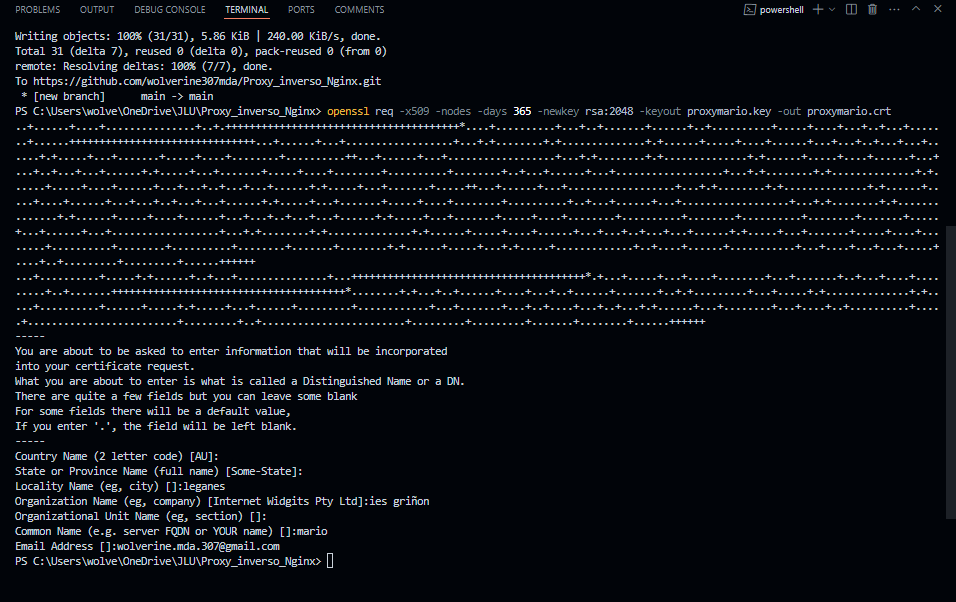

## PROXY
### Conf

Dentro del Directorio `conf` creamos el archivo `nginx.conf` con el siguiente contenido:

```
events {}

http {
    server {
        listen 80;
        server_name proxymario.com;

        # Redirigir todo el tráfico HTTP a HTTPS
        return 301 https://$host$request_uri;
    }

    server {
        listen 443 ssl;
        server_name proxymario.com;

        # Configuración de SSL
        ssl_certificate /etc/nginx/certs/proxymario.crt;
        ssl_certificate_key /etc/nginx/certs/proxymario.key;
        # Configuraciones SSL adicionales
        ssl_protocols TLSv1.2 TLSv1.3;
        ssl_ciphers 'EECDH+AESGCM:EDH+AESGCM:AES256+EECDH:AES256+EDH';
        ssl_prefer_server_ciphers on;


        # Configuración de proxy para la raíz
        location / {
            proxy_pass http://nginx_server;
            proxy_set_header Host $host;
            proxy_set_header X-Real-IP $remote_addr;
            proxy_set_header X-Forwarded-For $proxy_add_x_forwarded_for;
            proxy_set_header X-Forwarded-Proto $scheme;
        }

        # Configuración de proxy para /mario
        location /mario {
            proxy_pass http://nginx_server;
            proxy_set_header Host $host;
            proxy_set_header X-Real-IP $remote_addr;
            proxy_set_header X-Forwarded-For $proxy_add_x_forwarded_for;
            proxy_set_header X-Forwarded-Proto $scheme;
        }

        # Configuración de proxy para /dedomingo
        location /dedomingo {
            proxy_pass http://apache_server;
            proxy_set_header Host $host;
            proxy_set_header X-Real-IP $remote_addr;
            proxy_set_header X-Forwarded-For $proxy_add_x_forwarded_for;
            proxy_set_header X-Forwarded-Proto $scheme;
        }
    }
}
```

### Certs

Instalamos el programa OpenSSL.

Abrimos la terminal de OpenSSL y ejecutamos el siguiente comando con el nombre de nuestro server_name del proxy:
```
openssl req -x509 -nodes -days 365 -newkey rsa:2048 -keyout proxynombre.key -out proxynombre.crt
```


### Docker-compose

Creamos el `docker-compose.ylm` con la siguiente estructura: 

```
services:

  nginx:
    image: ubuntu/nginx # imagen de Nginx
    container_name: nginx_server # nombre del contenedor
    # ports:
    #  - "8081:80" # mapeo de puertos  HTTP
    volumes:
      - ./nginx/sites-available:/etc/nginx/sites-available # archivos de configuración de hosts virtuales
      - ./nginx/website:/var/www/html/ # directorio de los sitios web
    restart: always # reinicio automático
    networks:
      - webnet # red de contenedores

  apache:
    image: ubuntu/apache2 # imagen de Apache
    container_name: apache_server # nombre del contenedor
    # ports:
    #  - "8082:80" # mapeo de puertos  HTTP
    volumes:
      - ./apache/sites-available:/etc/apache2/sites-available # archivos de configuración de hosts virtuales
      - ./apache/website:/var/www/html/ # directorio de los sitios web
      - ./apache/htpasswd/.htpasswd:/etc/apache2/.htpasswd # archivo de contraseñas (en este caso lo uso)
    restart: always # reinicio automático
    networks:
      - webnet # red de contenedores

  proxy:
    image: ubuntu/nginx # imagen de Nginx
    container_name: proxy_server # nombre del contenedor
    ports:
      - "80:80" # mapeo de puertos  HTTP
      - "443:443" # mapeo de puertos  HTTPS
    volumes:
      - ./proxy/conf/nginx.conf:/etc/nginx/nginx.conf # archivo de configuración principal
      - ./proxy/certs:/etc/nginx/certs # directorio de certificados (hechos con openssl)
    restart: always # reinicio automático
    depends_on:
      - apache # dependencia de Apache
      - nginx # dependencia de Nginx
    networks:
      - webnet # red de contenedores

networks:
  webnet:
  
```


## NGINX
Para Nginx hacemos lo siguiente: 

### Websites

Creamos esta estructura con sus paginas por defecto:

```
websites/
├── index.html
└── mario.com/
    ├── index.html
    └── error/
        ├── 404.html
        └── 500.html
```

### Sites available
En la carpeta `sites-available` agregamos el `default`:
```
server {
    listen 80;
    listen [::]:80;

    root /var/www/html/; # Ruta de la carpeta raíz del dominio
    index index.html; # Archivo por defecto

    # Configuración para la raíz
    location / {
        try_files $uri $uri/ /index.html; # Intenta servir el archivo solicitado, si no existe, sirve
    }

    # Configuración para /mario
    location /mario {
        alias /var/www/html/mario.com;
    }

    # Personalizar la página de error 404
    error_page 404 /404.html;
    location = /404.html {
        root /var/www/html/mario.com/errors; # Ruta donde se encuentra el archivo de error
        internal; # Asegura que la página de error no sea accesible directamente
    }

    # la página de error 500
    error_page 500 502 503 504 /500.html;
    location = /500.html {
        root /var/www/html/mario.com/errors; # Ruta donde se encuentra el archivo de error
        internal; # Asegura que la página de error no sea accesible directamente
    }
}
```

## APACHE

En primer lugar creamos esta estructura:

```
apache/
├── htpasswd/
│   └── .htpasswd           # Archivo para almacenar usuarios y contraseñas para autenticación HTTP
├── sites-available/
│   └── 000-default.conf    # Archivo de configuración para el sitio web por defecto
└── website/
    └── dedom/
        ├── errors/
        │   ├── 401.html    # Página de error "No autorizado"
        │   ├── 403.html    # Página de error "Prohibido"
        │   ├── 404.html    # Página de error "No encontrado"
        │   └── 500.html    # Página de error "Error interno del servidor"
        ├── privado/
        │   ├── index.html  # Página principal dentro de la carpeta privada
        │   └── .htaccess   # Archivo de configuración para proteger la carpeta privada
        └── index.html      # Página principal del sitio web
```

### .htpasswd
Para crear un archivo .htpasswd que almacene los usuarios y contraseñas para la autenticación HTTP, utiliza el siguiente comando:
```
htpasswd -c /etc/apache2/.htpasswd nombre_usuario
```
### Archivos de Configuración

#### sites-available

En el directorio sites-available, puedes definir los archivos de configuración de los sitios web. Aquí se encuentra el archivo ``000-default.conf``, que se utiliza para configurar el sitio web por defecto.
```
<VirtualHost *:80>
    ServerAdmin wolverine.mda.307@gmail.com
    DocumentRoot /var/www/html/dedomingo.com

    # Redirigir /dedomingo a la raíz
    Alias /dedomingo /var/www/html/dedomingo.com

    # Protección de directorio
    <Directory "/var/www/html/dedomingo.com/privado">
        AuthType Basic
        AuthName "Acceso Restringido a Usuarios"
        AuthUserFile /etc/apache2/.htpasswd
        Require valid-user
        Options -Indexes
    </Directory>

    ErrorDocument 401 /errors/401.html
    ErrorDocument 403 /errors/401.html
    ErrorDocument 404 /errors/404.html
    ErrorDocument 500 /errors/500.html

</VirtualHost>
```

#### websites

En el directorio ``website/dedom/``, se organizan los archivos del sitio web, incluyendo:

``errors/``: Contiene las páginas de error personalizadas para los diferentes códigos de estado HTTP:

- `` 401.html``: Personaliza el mensaje de "No autorizado".
- ``403.html``: Personaliza el mensaje de "Prohibido".
- `` 404.html``: Personaliza el mensaje de "No encontrado".
- ``500.html``: Personaliza el mensaje de "Error interno del servidor".
- ``privado/``: Contiene archivos que requieren autenticación:

index.html: Página principal dentro de la carpeta privada.
.htaccess: Archivo de configuración que protege la carpeta privada.

##### .htacces

Agregamos el siguiente contenido:

```
AuthType Basic
AuthName "Acceso Restringido a Usuarios"
AuthUserFile /etc/apache2/.htpasswd
Require valid-user
Options -Indexes
```


## LANZAMIENTO DEL DOCKER COMPOSE Y COMANDOS USADOS

Construimos (build) y levantamos (up) los contenedores en segundo plano usando `docker-compose.yml`:
```
docker-compose --build -d
```

Levantamos  todos los contenedores definidos en docker-compose.yml en segundo plano:
```
docker-compose up -d
```

Detiene y elimina todos los contenedores, redes y volúmenes creados por `docker-compose up`:
```
docker-compose down
```

Para acceder a la terminal del servidor generado:
```
docker exec -it nginx_server /bin/bash
```

Detiene el contenedor llamado `nginx_server`:
```
docker stop nginx_server
```

 Muestra los registros de salida del contenedor `nginx_server` para buscar los errores si los hubiera:
```
docker logs nginx_server
```

Cada vez que modifiquemos algún archivo de configuración, debemos eliminar y volver a generar los contenedores para aplicar la nueva configuración.